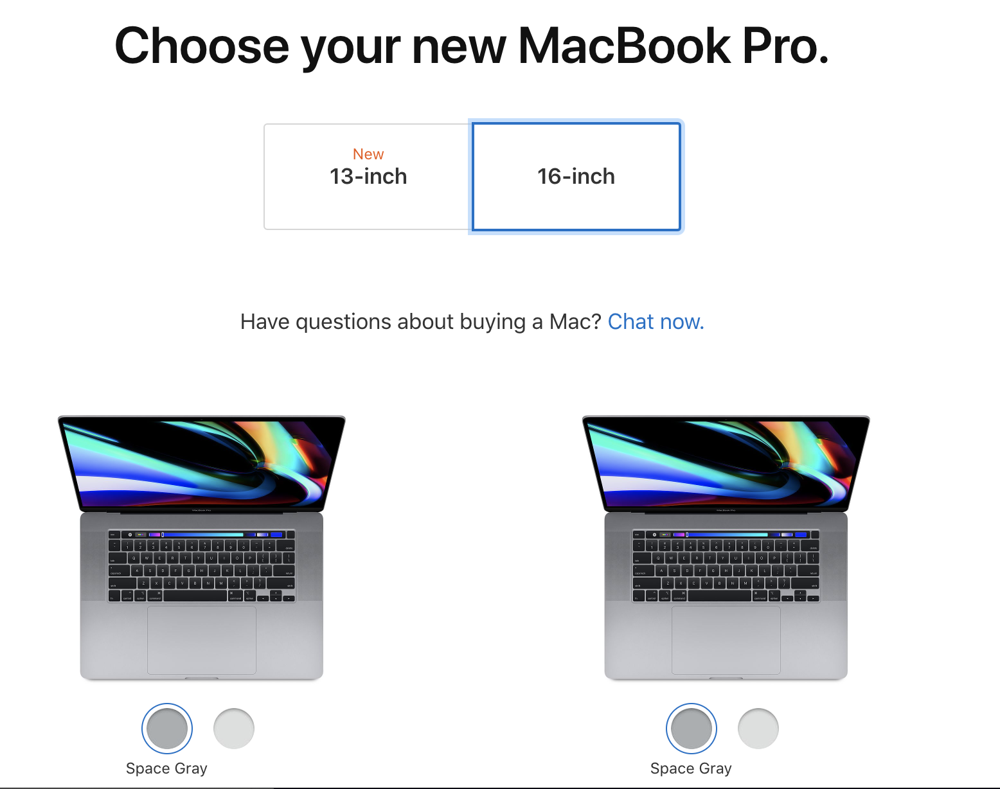

# MacBuddy

## Description 
To assist users in either choosing a MacAir or MacBook

## Installation
npm init
  
```bash 
npm install
```   

## Usage
instructions





## Credits
undefined

## License 

[](https://shields.io)

## Features 


## Contributing 


## Tests


## Links
[Link to github](https://github.com/stepheff1994)


